# WarfaRef-Showcase

**A Digital Health Mobile Application for Warfarin Self-Monitoring and Early Risk Detection**  
Developed at the University of California, San Diego in partnership with Salve Therapeutics 
Team Members: Hunter Risdon, Numa Yazadi, Somto Ikeanyi
Advisor: Stefan Lukianov

---

## Overview
WarfaRef is a cross-platform mobile application designed to modernize anticoagulation therapy management for patients on warfarin. Built using React Native and Firebase, WarfaRef enables patients to monitor their INR values, visualize health trends, and receive real-time alerts for abnormal readings and health trends that correspond with increased risk of adverse clinical events. The application currently supports manual data entry and is architected for future integration with Bluetooth INR devices and Electronic Health Record (EHR) systems.

> **Note:** The source code for WarfaRef is **private** due to proprietary healthcare algorithms and HIPAA-related design considerations. Recruiters and collaborators may request restricted access by contacting the team directly.

---

## Key Features
- **Early Risk Detection**: Real-time alerts based on personalized thresholds for abnormal INR values, using synthetic-data trained logic models.
- **Machine Learning Personalization**: Custom INR range predictions based on patient profile data and risk factors.
- **Data Visualization**: Interactive graphs, trend displays, and calendar-based health tracking.
- **EHR Integration (in progress)**: Future provider-facing dashboard with HL7 FHIR compatibility.

---

## Technology Stack
- **Frontend**: React Native (Expo)
- **Backend**: Firebase Authentication & AsyncStorage
- **ML Integration**: Python-based model prototyping using synthetic patient data (via Synthea), with planned integration into AutoML pipelines
- **Upcoming**: HL7 FHIR-based EHR communication; security mechanisms aligned with HIPAA-compliant data flow standards (future phases)

---

## Screenshots & Visuals
> _The following screenshots demonstrate the primary user flows and features of the WarfaRef mobile application._

<table>
  <tr>
    <td><strong>Login</strong> 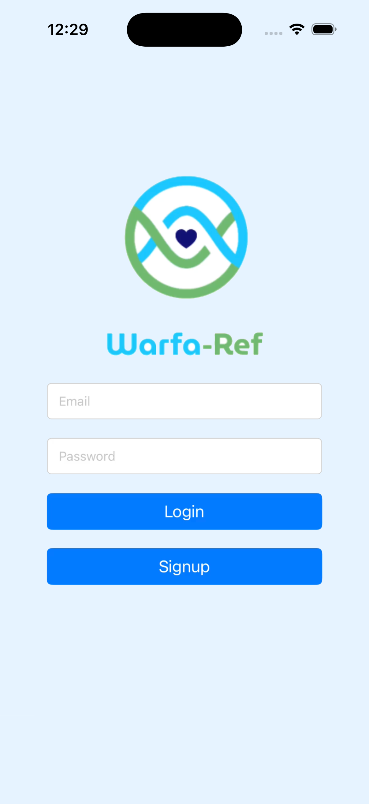</td>
    $1
    <td><strong>Questionnaire</strong> 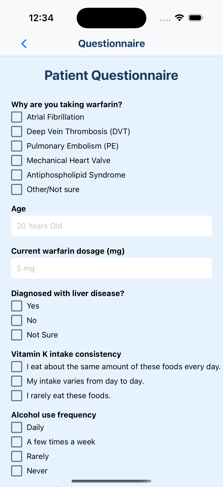</td>
    <td><strong>Notifications</strong> 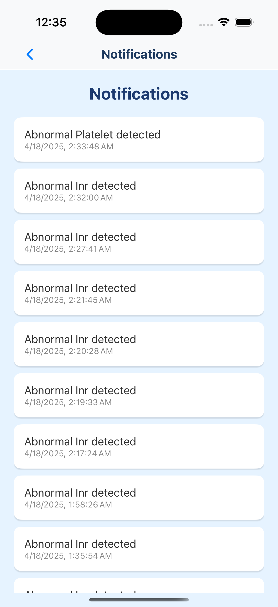</td>
  </tr>
  <tr>
    <td><strong>Statistics (Averages)</strong> 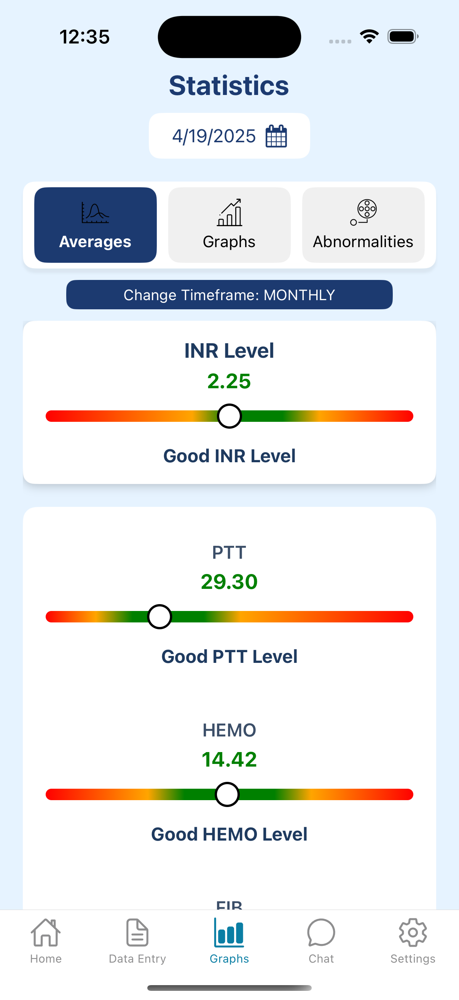</td>
    <td><strong>Statistics (INR Graph)</strong> 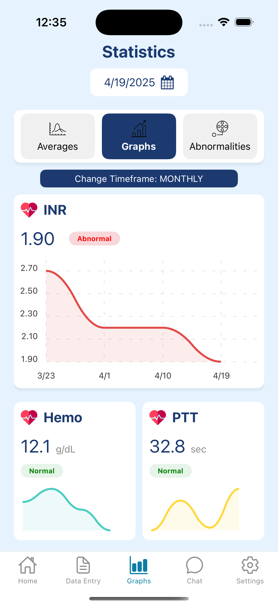</td>
    <td><strong>Statistics (All Graphs)</strong> 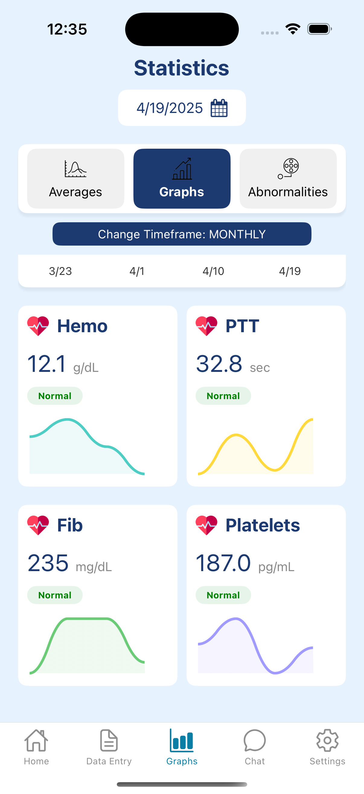</td>
  </tr>
  <tr>
    <td><strong>Abnormalities</strong> 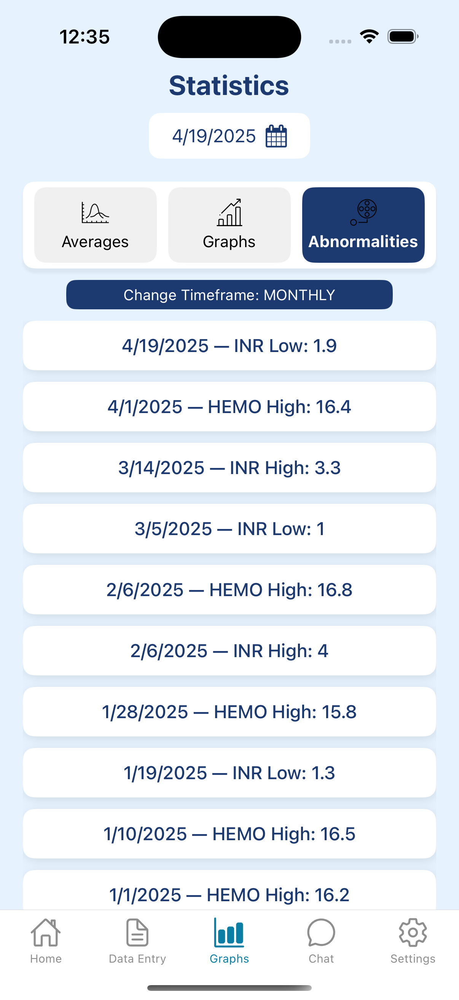</td>
    <td><strong>Calendar</strong> 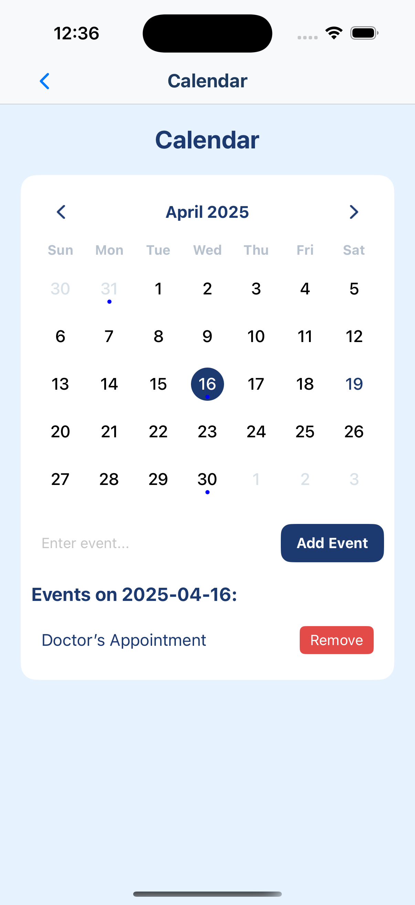</td>
    <td><strong>Chat</strong> 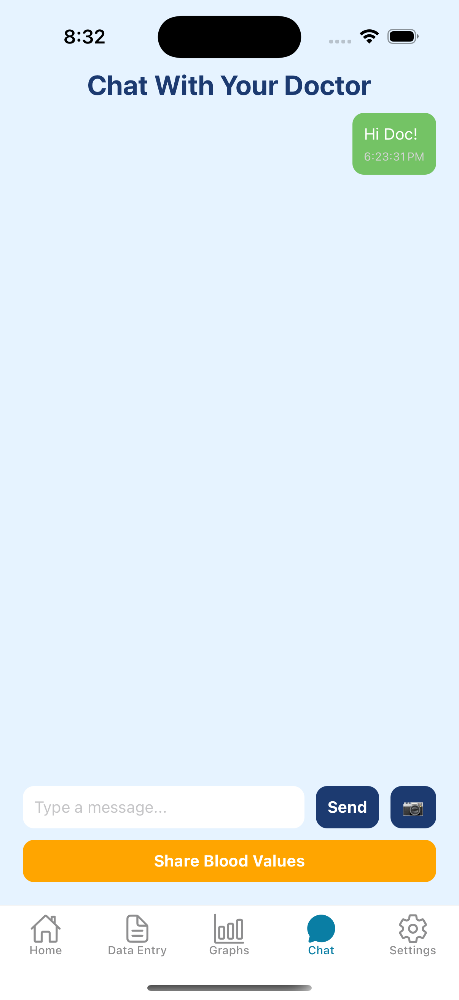</td>
  </tr>
  <tr>
    <td><strong>Settings</strong> 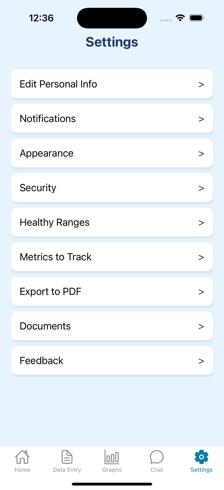</td>
    <td><strong>Home</strong> 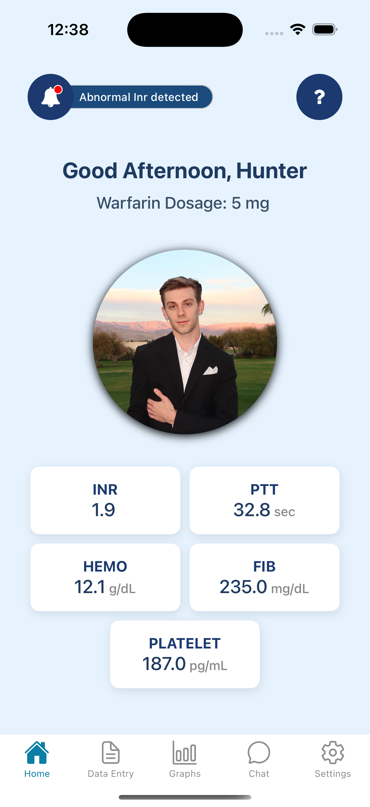</td>
  </tr>
</table>

**Original Figma Design**  
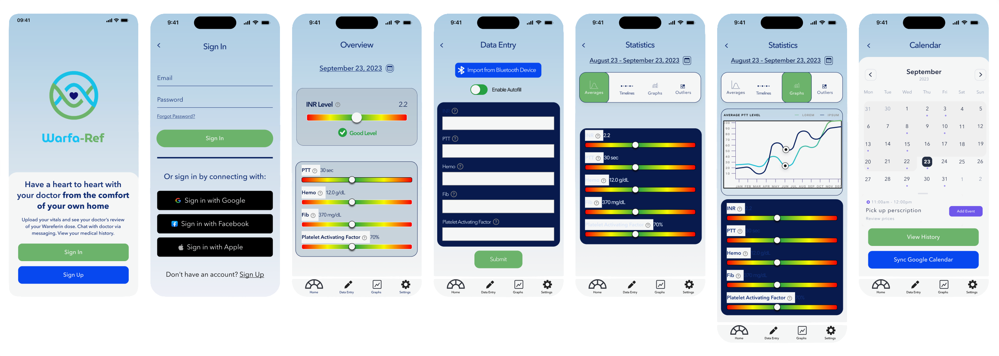

**Video Demo**  
[Link to Demo Video](videos/demo-link.mp4)

**WarfaRef Design Poster**  
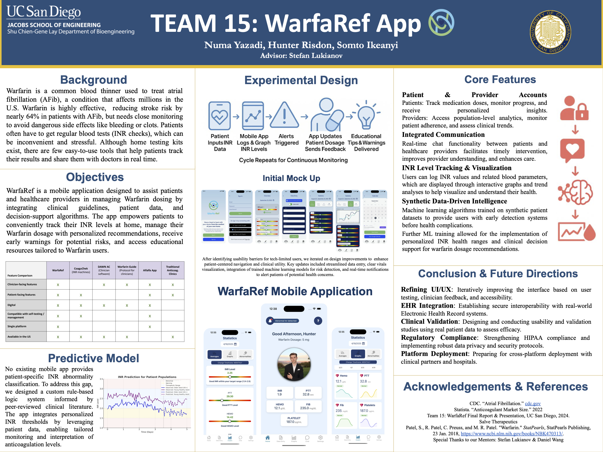

**Workflow Diagram**  
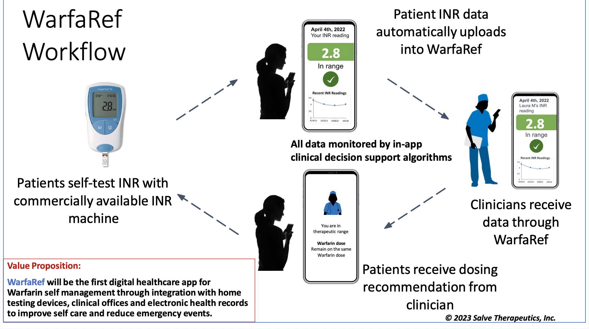

**Competitor Matrix**  
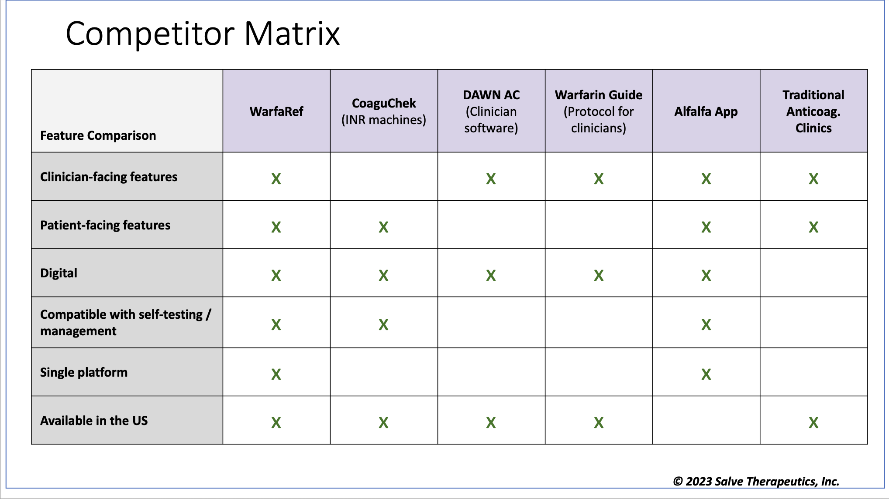

---

## Research & Design Foundations
WarfaRef was designed in alignment with:
- IEC 62304 (Medical Software Lifecycle)
- ISO 14971 (Risk Management)
- FDA 21 CFR Part 11 (Electronic Records)
- HL7 FHIR (Healthcare Interoperability)

Our decision logic for alerting abnormal INR values is based on peer-reviewed clinical guidelines and further enhanced with ML techniques trained on synthetic patient cohorts. The model developed for risk prediction has been trained solely on synthetic datasets and has not yet been tested or validated using real-world patient data. It is intended only as a supplemental tool to help patients better understand their health data. Patients must always consult with their healthcare provider before making any decisions based on app-generated insights. We plan to pursue clinical testing and validation in the future, once full compliance with HIPAA and relevant IRB (Institutional Review Board) guidelines has been achieved.

---

## Roadmap
- ✅ Core patient app with real-time alerts
- 🔄 Provider dashboard under development
- 🔄 Bluetooth INR device support
- 🔄 EHR integration (FHIR compliant)
- 🔄 AI-driven dosing recommendation engine (under clinical trial design)

---

## Future Vision & Clinical Impact
WarfaRef aims to:
- Improve **Time in Therapeutic Range (TTR)** to over 60%
- Reduce provider response time to critical INR events by 40%
- Enable broader use of INR home-testing across elderly populations
- Serve over **6 million warfarin users** and **900,000 providers** in the U.S.

In the next phase, we aim to complete pilot deployment in San Diego clinics, publish clinical trial results, and finalize HIPAA/FDA compliance for scaled deployment.

---

## Team & Contributions
- **Hunter Risdon**: Full-stack development, UI/UX design, backend data processing, algorithm integration
- **Numa Yazadi**: UI/UX design, algorithm development, frontend/backend bridging, usability testing
- **Somto Ikeanyi**: Iconography

> Developed at **UC San Diego – Bioengineering Department** in partnership with **Salve Therapeutics**

---

## Contact & Access
For demo access (TestFlight or Expo) or inquiries about restricted source code:
- Email: risdonhunter@gmail.com  
- LinkedIn: www.linkedin.com/in/hunter-risdon  

> **License**: This repository is licensed under a View-Only Intellectual Property License. See LICENSE for terms.
